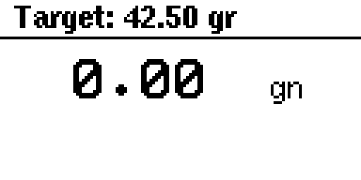
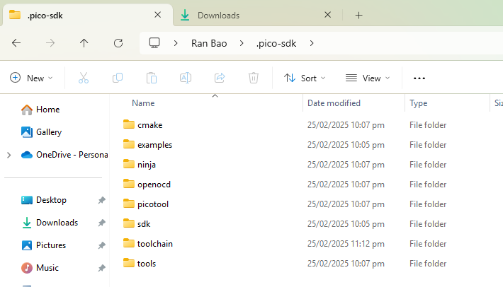

# OpenTrickler RP2040 Controller
This repo is for the firmware that utilises the Raspberry Pi RP2040 micro controller OpenTrickler RP2040 Controller.

## What's New — Branch `feature/ai-tuning-port`

This branch ports the AI auto-tuning system from [OpenTrickler-v2](https://github.com/Jump73/OpenTrickler-v2) and integrates it fully into the RP2040/RP2350 firmware.

### AI Auto-Tuning (`src/ai_tuning.*`)
Automatic PID parameter optimisation using a binary-step search algorithm:
- **Phase 1 (COARSE_ONLY)** — tunes coarse trickler Kp/Kd across configurable search bounds
- **Phase 2 (FINE_ONLY)** — tunes fine trickler Kp/Kd, with a coarse pre-charge at the start of each drop
- Configurable time targets: `coarse_time_target_ms` (c14) and `total_time_target_ms` (c15)
- Configurable search bounds (Kp/Kd min/max), noise margin, and max overthrow threshold via `/rest/ai_tuning_config_set`
- Results persisted in flash; apply best parameters to a profile via `/rest/ai_tuning_apply`

### ML Data Collection (`src/ml_data_collection.*`, `src/ai_drop_telemetry.*`)
- Records per-drop telemetry (weight, timing, motor params) to flash during normal charges when enabled
- Toggle via charge mode config field `c16` (`ml_data_collection_enabled`)

### Charge Mode Integration (`src/charge_mode.cpp`)
- Charge loop queries `ai_tuning_get_next_params()` and overrides PID parameters when tuning is active
- Coarse pre-charge phase injected at start of each drop in Phase 2
- `ai_tuning_record_drop()` called after every drop to feed results back to the tuner
- RST button cancels active tuning session
- Tuning completion detected after cup removal — charge mode exits automatically

### Error System (`src/errors.*`)
- Centralised error reporting ported from v2; integrates with display and REST API

### G&G Scale Fix
- Fixed serial parsing for G&G / JJB scale driver

### Web UI (`src/html/web_portal.html`)
New **AI Tuning** section in the web portal Settings drawer:
- Select profile and target charge weight, then start/cancel/apply tuning
- Live progress panel (drops completed, progress %, current Kp/Kd) overlaid on the Trickler page during active tuning
- Recommended parameters displayed on completion with one-tap Apply
- Advanced collapsible panel for Kp/Kd search range and noise margin configuration
- ML Data Collection toggle
- REST endpoints used: `/rest/ai_tuning_start`, `/rest/ai_tuning_status`, `/rest/ai_tuning_apply`, `/rest/ai_tuning_cancel`, `/rest/ai_tuning_clear_history`, `/rest/ai_tuning_config`, `/rest/ai_tuning_config_set`

### RP2350 Support
- All new modules compile cleanly for both `pico_w` (RP2040) and `pico2_w` (RP2350) targets

Join our [discord server](https://discord.gg/ZhdThA2vrW) for help and development information. 

## Get Started
### Use with mini 12864 display
1. From the main menu, select "Start".

    
2. Provide the target charge weight in grain then press Next to continue.

    
3. Remember to put pan on the scale. 

    
4. Wait for scale to stable at 0. Or press the rotary button to force Re-zero. 

    
5. Wait for charge to reach the set point

    
6. Once the charge set point is reached, remove the pan. The program shall restart from step 4.

    

## Pre-build firmware

You can download the pre-built firmware based on the latest release from above link. Similar to flashing other RP2040 firmware, you need to put the Pico W into the bootloader mode by pressing BOOTSEL button and plug in the micro-USB cable. Then you can copy the .uf2 file from the package to the pico. Shortly after the Pico W will be programmed automatically. 

## Build OpenTrickler firmware from source on Windows

Reference: https://datasheets.raspberrypi.com/pico/getting-started-with-pico.pdf

### Prerequistes  
[Git](https://gitforwindows.org/) and [VSCode](https://code.visualstudio.com/) are required to build the firmware. To install build dependencies, you will need to use [VSCode Raspberry Pi Pico extension](https://marketplace.visualstudio.com/items?itemName=raspberry-pi.raspberry-pi-pico) and create an pico-example project (any project will trigger the download of pico-sdk, a collection of tools required to build the firmware locally). 

Then you can verify the installation of pico-sdk by inspecting the path from `C:\Users\<user name>\.pico-sdk`. 

 
### Downloading Source Code
From PowerShell, execute below command to fetch the source code: 

    git clone https://github.com/eamars/OpenTrickler-RP2040-Controller

Next change to the cloned directory

    cd OpenTrickler-RP2040-Controller

Next use git to initalise the required submodules

    git submodule init

Now using git clone all submodules. It may take up to 5 minutes to clone all required submodules.

    git submodule update --init --recursive
 
### Configure CMake
Open the PowerShell, run the below script to load required environment variables: 

    .\configure_env.ps1

To build firmware for Pico W, from the same PowerShell session, run below command:

    cmake -B build -G Ninja -DCMAKE_BUILD_TYPE=Debug -DPICO_BOARD=pico_w

To build firmware for Pico 2W, from the same PowerShell session, run below command:

    cmake -B build -G Ninja -DCMAKE_BUILD_TYPE=Debug -DPICO_BOARD=pico2_w

### Build Firmware
From the same workspace root directory, run the below command to build the firmware from source code into the `build` directory: 

    cmake --build build --config Debug

On success, you can find the app.uf2 from `<workspace_root>/build/` directory. 

### Use VSCode
You need to call VScode from script to pre-configure environment variables. You can simply call

    .\run_vscode.ps1

The VSCode cmake plugin is pre-configured to build for Pico 2W by default. You can change the build config to Pico W by modifying `<workspace_root>.vscode/settings.json`. 
