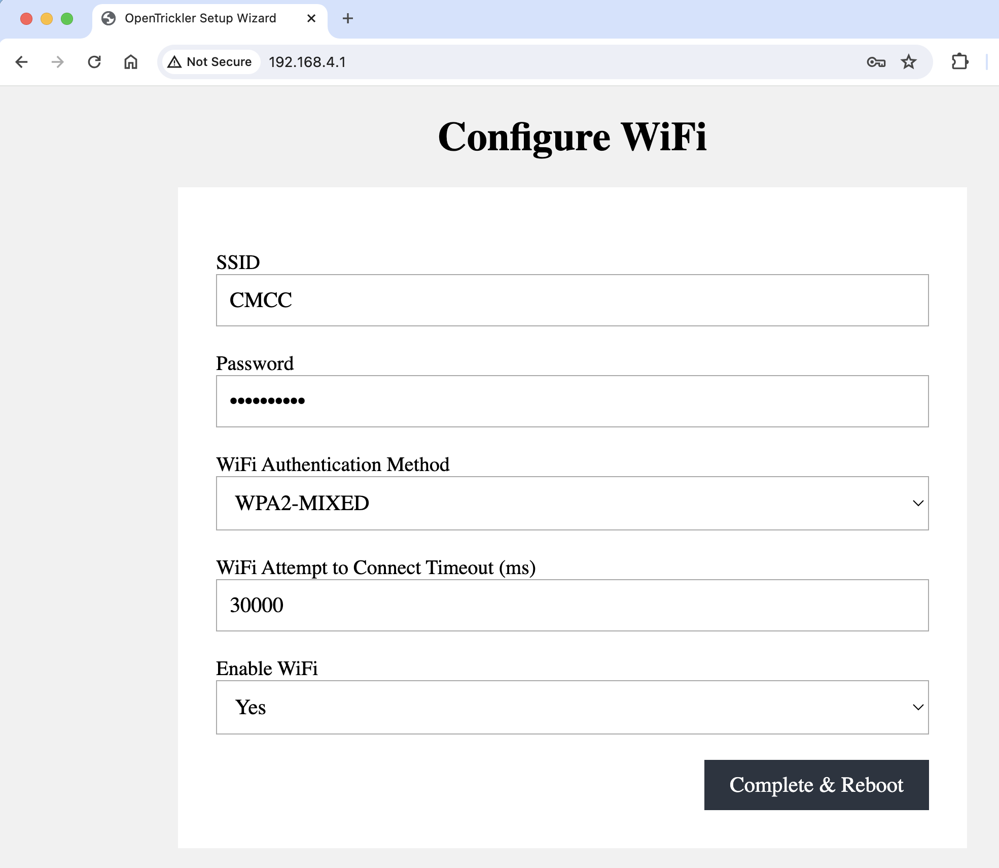

# OpenTrickler Wireless

The OpenTrickler uses the Pico W on board green LED to indicate the wireless status if you don't have the mini 12864 display attached.

- Solid: The OpenTrickler is connected to the home network. 
- Slow flashing (1Hz): The OpenTrickler is operated at Access Point (AP) mode with default SSID and the password. You need to configure the wireless settings to connect the OpenTrickler to your home network. 

If you have the mini 12864 screen attached, you can use the screen to query the current network status by navigating t *Wireless -> WiFi Info* page.

> Due to the limitation of the Pico W Wireless Chip capability, the OpenTrickler can only connect to the 2.4GHz wireless network. 

The below screenshot shows the OpenTrickler is operating at the AP mode. 

Alternatively, if you see the page below then the OpenTrickler is already connected to your home network and the IP address is displayed. 

## Connect to Wireless

To connect the OpenTrickler to your home network, you will need a laptop with wireless accessibility. **For now the smart phone and iPads are not supported.**

1. Look for the OpenTrickler from the list of SSIDs. Each OpenTrickler will generate the random 4 digit suffix based on its unique id. 
   

2. Select the OpenTrickelr's SSID. Your computer will prompt for the password. By default the password is **opentrickler**.
   

3. Once connected, you should be assigned with IP address of *192.168.4.16*. To access the OpenTrickler configuration page, you need to visit [http://192.168.4.1](192.168.4.1). You will be prompted to enter your WiFi credentials. You need to enter below information:
    
   
   - SSID: The wireless network name.
   
   - Password: Your wireless network password.
   
   - WiFi Authentication Method: Usually you need to select `WPA2-MIXED`. 
   
   - Enable WiFi: Select `YES`

4. Press **Complete & Reboot** button to save the WiFi credentials and apply the new wireless configurations. 

5. You can check the LED status to verify your change. 
