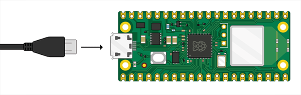
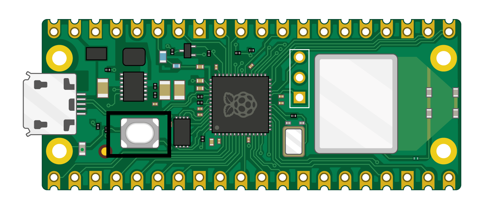
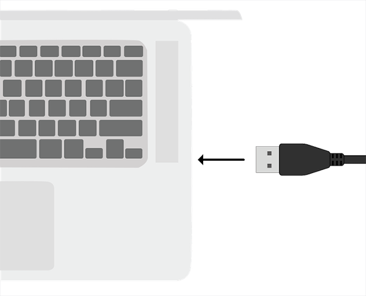
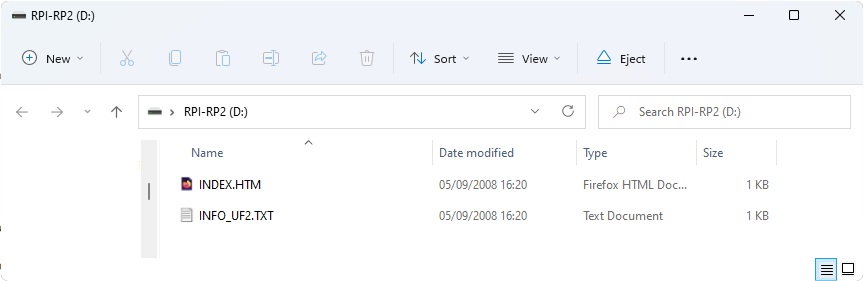

# Firmware Update via USB

1. Download the latest debug version (uf2-debug) of OpenTrickler controller firmware from the [latest release](https://github.com/eamars/OpenTrickler-RP2040-Controller/releases), unzip the package and look for app.uf2 under build directory. 
2. Disconnect the OpenTrickler controller board from the 12/24V power supply. 
3. Connect the small end of your micro USB cable to the Raspberry Pi Pico W
   
4. Hold down the BOOTSEL button on your Raspberry Pi Pico W
   
5. Connect the other end to your desktop computer, laptop, or Raspberry Pi while still holding the BOOTSEL button. 
   
6. Your file manager should open up, with Raspberry Pi Pico being show as an externally connected drive. At this stage you can release the BOOTSEL button now. Drag and drop the firmware file "app.uf2" into the file manager. Your Raspberry Pi Pico should disconnect and the file manager will close.
   
