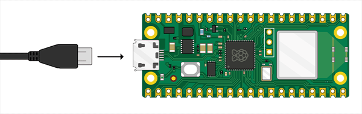
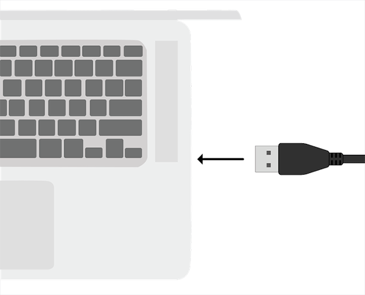

# Firmware Update via USB

This is how firmware is installed by cable: the first time, the move from an older version, and to bring back a unit that does not start. Your settings are kept: they are stored on the controller board, not on the Pico.

> [!TIP]
> Some USB cables are charge-only and cannot transfer data. If your Raspberry Pi Pico does not appear as a drive on your computer after the steps below, try a cable that supports data transfer.

1. From the [latest release](https://github.com/eamars/OpenTrickler-RP2040-Controller/releases/latest), download the file for your board. The board's name is printed on the Pico. Each file's name starts with its version, `OpenTrickler-2.0.0-` for example, and ends:
   - Raspberry Pi Pico W: `pico_w_full_install.uf2`
   - Raspberry Pi Pico 2 W: `pico2_w_full_install.uf2`
2. If you want a copy of your settings, open the unit's web page and press **Export Config** on its **System Control** page. The install keeps them, but a copy does no harm.
3. Disconnect the OpenTrickler controller board from the 12/24V power supply.
4. Connect the small end of your micro USB cable to the Raspberry Pi Pico.
   
5. Hold down the BOOTSEL button on the Raspberry Pi Pico.
   
6. Connect the other end to your desktop computer, laptop, or Raspberry Pi while still holding the BOOTSEL button.
   
7. Your file manager opens, with the Raspberry Pi Pico shown as a drive. Release the BOOTSEL button. Drag and drop the file you downloaded onto the drive. The Pico disconnects and the file manager closes: the firmware is installed.
   
8. Disconnect the USB cable and connect the 12/24V power supply again. The unit starts on the new firmware.

**Releases before the update over Wi-Fi** (v1.20 and older) carry an `app.uf2` in a zip in place of these files. The steps are the same with that file. To go back to one of them, see [Going back to an older firmware](firmware_downgrade.md).
